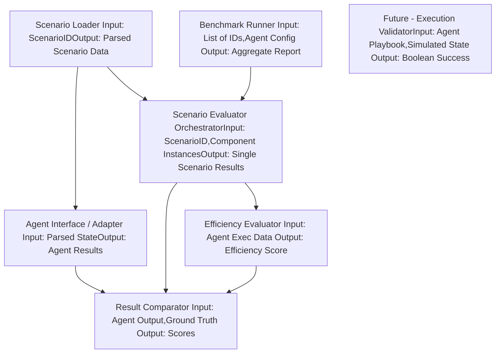

# Eval pipeline.

Let's detail each component:

1.  **`ScenarioLoader`**
    * **Role:** Responsible for locating and reading all the raw data files for a single scenario from storage (where your generation process put them). It parses the different file formats (Markdown, JSON, JSONL, YAML) into structured data representations.
    * **Inputs:** Scenario Identifier (e.g., `"scenario_001"`). Configuration for the scenario data storage location.
    * **Outputs:** A single structured object or dictionary containing:
        * Parsed `description.md` content.
        * Parsed data from all files in `state/` (logs as list of dicts, metrics as structured dict, events as list of dicts, topology dict, config dict/object).
        * Parsed data from all files in `ground_truth/` (root cause string, causal graph list/dict, resolution string, metadata dict).
    * **Key Functionality:** File I/O, format parsing (JSON, YAML, newline-delimited JSON, plain text/markdown).
    * **POC Note:** This is essential from day one. Implement straightforward file reading and parsing using standard libraries.

2.  **`AgentInterface / Adapter`**
    * **Role:** This is the critical abstraction layer. It provides a standard way for the evaluation pipeline to *interact* with any AI SRE agent being tested. It translates the structured scenario data loaded by the `ScenarioLoader` into whatever format the specific agent expects and translates the agent's response back into a standard structured format the `ResultComparator` can process.
    * **Inputs:** The structured scenario data (specifically the `description` and `state` components). Configuration specific to the agent (e.g., API key, endpoint, model name).
    * **Outputs:** A standard structured object or dictionary representing the agent's identified root cause, causal chain, and proposed/executed resolution.
    * **Key Functionality:**
        * Method to "present" the scenario data to the agent.
        * Translating internal structured data into agent-specific input format (e.g., a prompt string for an LLM, a specific API payload).
        * Calling the agent's API or function.
        * Translating the agent's potentially free-form or agent-specific output into the SREBench standard output structure (e.g., extracting root cause text, parsing a generated JSON object).
        * Handling agent response parsing errors, timeouts, etc.
    * **POC Note:** You'll need at least one concrete implementation (e.g., `LLMAgentAdapter`) that takes the loaded state data and crafts a prompt for an LLM asking it to perform RCA and propose a resolution, then parses the LLM's response into your standard agent output structure. Defining this standard agent output structure *first* is crucial.

3.  **`ResultComparator`**
    * **Role:** Compares the structured output from the `AgentInterface` against the structured `ground_truth/` data from the `ScenarioLoader` for RCA Accuracy and Resolution Correctness.
    * **Inputs:** Standardized Agent Output (from `AgentInterface`), Structured Ground Truth (from `ScenarioLoader`).
    * **Outputs:** A dictionary of comparison scores for the scenario (e.g., `{"rca_root_cause_score": 0.8, "rca_causal_chain_score": 0.5, "resolution_correctness_score": 1.0}`). Scores typically range from 0.0 to 1.0.
    * **Key Functionality:**
        * Implements the logic for comparing root cause strings (e.g., semantic similarity, keyword overlap).
        * Implements the logic for comparing causal chains (e.g., comparing ordered lists or simplified graphs).
        * Implements the logic for comparing resolution descriptions (e.g., semantic similarity, checking for required keywords like "increase memory limit").
        * Handles scoring partial matches.
    * **POC Note:** This will be simplified. Start with basic exact string matching for root cause/resolution, or simple keyword checks. Causal chain comparison might be skipped or done manually for the very first POC runs. This component will evolve significantly over time.

4.  **`EfficiencyEvaluator` (Simulated MTTR)**
    * **Role:** Calculates a score representing the agent's efficiency or simulated MTTR during the scenario.
    * **Inputs:** Depends on the chosen metric. Could be the agent's reported steps taken (if the `AgentInterface` captures this), or simply the real-world time taken for the `AgentInterface` call. Might also use scenario metadata (e.g., incident start time if simulating timeline-based).
    * **Outputs:** An efficiency score or simulated MTTR value for the scenario.
    * **Key Functionality:** Implements the defined simulated MTTR calculation.
    * **POC Note:** Can be skipped initially, or implemented as a simple timer around the `AgentInterface` call.

5.  **`ScenarioEvaluatorOrchestrator`**
    * **Role:** Orchestrates the evaluation process for a *single* scenario. It calls the `ScenarioLoader`, passes the relevant data to the `AgentInterface`, and then feeds the agent's output and ground truth into the `ResultComparator` and `EfficiencyEvaluator`. It aggregates the scores for that single scenario.
    * **Inputs:** A Scenario ID, instances of the `ScenarioLoader`, `AgentInterface`, `ResultComparator`, and `EfficiencyEvaluator`.
    * **Outputs:** A dictionary containing all the evaluation results and scores for the specific scenario.
    * **Key Functionality:** Workflow management for one scenario run. Error handling if a component fails.
    * **POC Note:** This is the core loop logic for evaluating one scenario.

6.  **`BenchmarkRunner`**
    * **Role:** The top-level component. Manages the evaluation process across a *list* of scenarios. Configures and initializes other components. Collects results from multiple `ScenarioEvaluatorOrchestrator` runs. Aggregates results and generates the final benchmark report.
    * **Inputs:** List of Scenario IDs to run, configuration for the agent(s) to test, configuration for reporting.
    * **Outputs:** A comprehensive report summarizing the agent's performance across all evaluated scenarios (average scores, distributions, etc.).
    * **Key Functionality:** Iteration, configuration loading, results aggregation, report generation (console output, file output like JSON or CSV).
    * **POC Note:** The main script you run. It will loop through your 10 scenario IDs.

7.  **(Optional Future Component) `ExecutionValidator`**
    * **Role:** (Beyond POC) Provides a more definitive check for Resolution Correctness. If the agent outputs a machine-readable playbook, this component attempts to "execute" that playbook against a representation of the incident state to see if the problem is resolved.
    * **Inputs:** Agent's output playbook, A model or simulation of the scenario's state that can react to commands.
    * **Outputs:** Boolean (True if resolved, False otherwise), details on execution (e.g., errors encountered).
    * **Key Functionality:** Playbook language interpretation, state simulation, outcome verification.
    * **POC Note:** High complexity, requires building a state simulation layer. Defer this.

This component design provides a clear roadmap for building the evaluation pipeline. For the POC, focus on implementing the essential components (`ScenarioLoader`, `AgentInterface` (a simple one), `ResultComparator` (with basic logic), `ScenarioEvaluatorOrchestrator`, and `BenchmarkRunner`) to get a functional end-to-end evaluation loop running on your 10 generated scenarios.

Which component would you like to tackle defining in more detail first? The `AgentInterface` is often a good starting point, as defining the standard input/output for the agent dictates how other components interact.